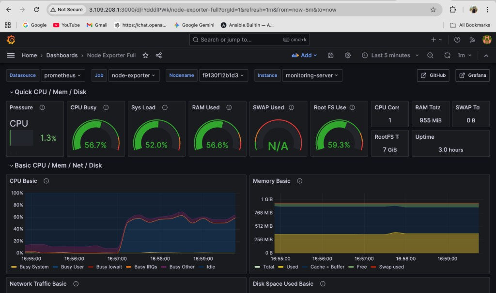

# Server Monitoring Stack on AWS



Monitoring stack that collects system metrics (CPU, memory, disk, network) and visualizes them in Grafana. All services run in Docker.

**Node Exporter** → **Prometheus** → **Grafana**

## Features

- Metrics via Node Exporter, storage in Prometheus, dashboards in Grafana
- One command to run: `docker compose up -d`
- Works locally or on a single EC2 instance (e.g. t3.micro, Ubuntu)

## Tech stack

Prometheus Node Exporter · Prometheus · Grafana · Docker Compose · (optional) AWS EC2

## Quick start

```bash
git clone https://github.com/yourusername/aws-monitoring-stack-prometheus-grafana.git
cd aws-monitoring-stack-prometheus-grafana
docker compose up -d
```

Open **http://localhost:3000** → login `admin` / `admin` → add data source **Prometheus** with URL `http://prometheus:9090` → import dashboard **1860** (Node Exporter Full).

## Stop the stack

```bash
docker compose down
```

## Architecture

```
Host (EC2 or laptop)
├── Node Exporter :9100  — collect metrics
├── Prometheus    :9090  — store & query
└── Grafana       :3000  — dashboards

Browser → http://<host>:3000
```

## Deploy on EC2

Spin up Ubuntu (e.g. t3.micro), open ports **22, 3000, 9090**, install Docker, clone this repo, then `docker compose up -d`. Grafana at `http://<ec2-ip>:3000`.

## Project structure

```
├── docker-compose.yml
├── prometheus.yml
└── docs/grafana-dashboard.png
```
